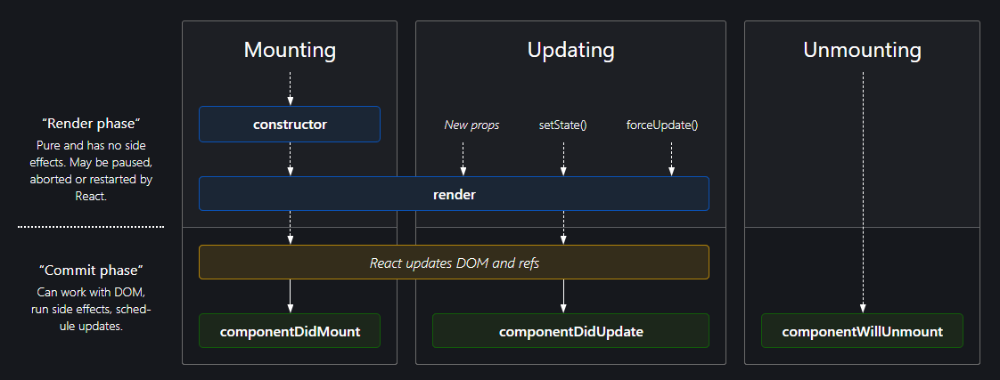

// EP1-2 - Inception - Igniting our app

Q1: - Difference between ~ and ^ sign inside package.json?
A1: - ^ or carrat sign will be responsible for upgrading the minor version of dev dependencies whereas ~ or tilde sign will upgrade the major version of dev dependencies, and 
      it is safe to use ^ instead of ~ sign, as if the dependency's major version is upgraded, then there are high chances that something might break.

Q2: - What is the use -D when installing any package using npm?
A2: - -D is used if we want the dev dependencies on the development machine.

Q3: - What is Package.json file?
A3: - package.json file is responsible for maintaining all dependencies that our project requires with version.

Q4: - WHat is package-lock.json?
A4: - package-lock.json will have the exact version of all the modules/dependencies installed via npm. whereas package.json will be having approximate version of the modules/dependencies.

Q5: - What is transitive dependencies?
A5: - The dependencies which in turn also have other dependencies is know as transitive dependencies.

Q6: - Benefits of Parcel bundler?
A6: - 1. Dev Build
      2. Local Server
      3. HMR = Hot Module Replacement
      4. File Watching Algorithm
      5. Caching - Faster Builds
      6. Image Optimization
      7. Minification
      8. Bundling
      9. Compress
      10. Consistent Hashing
      11. Code Splitting
      12. Differential Bundling - support older browser
      13. Diagnostic
      14. Error Handeling
      15. HTTPs
      16. Tree Shaking - remove unused code
      17. Different dev and prod bundles

// EP-3 - Laying the foundations
Q7: - How does JSX helps in writing react code?
A7: - In normal JS, we use React.createElement again and again for creating HTML elements, but it's not an efficient way to do it, so we use JSX, and in JSX, we directly write what element we need to add to HTML page.

Q8: - What exactly is JSX?
A8: - JSX is nothing but JS with HTML like syntax. e.g, const heading = <h1> Hello There </h1>

Q9: - How JSX code is converted into JS?
A9: - Babel transpiler is responsible for converting the JSX into React.createElement and then this method returns an object which is then converted into HTML element by using root.render().

Q10: - How many types of React components are there?
A10: - Mainly there are two types of components in react: - 
            1. Functional based components: - These include returning of JSX from a JavaScript function.
                                              e.g., const FunctionalBasedComponent = () => {
                                                    return (
                                                      <h1>Welcome to functional component</h1>
                                                    )
                                                    }
                                                    root.render(<FunctionalBasedComponent />);
            2. Class based components: - These include returning of JSX from a JavaScript classes.

Q11: - What is component composition?
A11: - The insertion of any component inside any other component, then it is called component composition.

Q12: - How to create an React element?
A12: - We can create an React element using React.createElement and it will accept three parameters
       1. What type of element 
       2. Attributes related to the element.
       3. What should go inside this element
       e.g., React.createElement("h1", {class="h1Heading"}, "HI I am inside H1 Heading");

       We can also have nested elements inside any HTML element just like this
       e.g., React.createElement("h1", {className:"h1Heading"}, "Hi I am inside H1 heading", React.createElement("h2", {className:"h2Heading"}, "HI I am inside H2 Heading"));
       
       and if we want to have multiple child under same parent, we can pass them as an array
       e.g., React.createElement("h1", {className:"h1Heading"}, "Hi I am inside H1 heading", [React.createElement("h2", {className:"h2Heading"}, "HI I am inside H2 Heading"), React.createElement("h2", {className:"h2Heading"}, "HI I am inside H2 Heading")]);

Q13: - What are props in React?
A13: - Props are just arguments passed to the functional method in js, and when this function recieves arguments, it will be in form of js objects. 
       e.g., const myFunc = (props) {
            console.log(props);
       };

       <FunctionalComponent myName = "Milan", myAge = "24"/>

       output: - {
            myName: "Milan",
            myAge: "24"
       }

Q14: - What is config driven UI?
A14: - Controlling UI based on some data or configuration is known as config driven UI.

Q15: - What does "Each prop should have a unique key" warning mean?
A15: - It means that each rendered component should have a unique key and it can be defined using key attribute. Also, by implementing it, it helps in optimization of code and re-rendering becomes faster. NOTE: - WE must not use index's as keys.

Q16: - What are two kinds of exports used in js?
A16: - There are 2 types of exports used in JS
       1. Default export
          e.g., export default varName/ FunctionName
       2. Named export
          e.g., export varName/ FunctionName

Q17: - What are React Hooks?
A17: - React Hooks are just normal js functions written by facebook developers.
       There are mainly two hooks that are widely used inside React: - 
              1. useState: - Mainly used when we want to store the data through which the rendering depends, i.e., data driven rendering.
              2. useEffect: - This hooks is invoked whenever there is any change in the state variable, this will always be invoked after rendering is completed.

Q18: - What is React Algorithm/ Reconciliation Algorithm?
A18: - The comparison of Virtual DOM with the actual DOM using DIFF ALGORITHM, so that React can compare the changes and updates only required section of HTML page.

Q19: - What is virtual DOM?
A19: - Virtual DOM is nothing but actual representation of DOM (React Elements).

Q20: - What is React Fibre?
A20: - React Fibre is a new way of doing comparison between virtual DOM and Actual DOM introduced in React 16.

Q21: - What is Monolith Architecture?
A21: - In Monolith Architecture, we used to have only one service and in that service, we will do everything like, 
       - makking API calls
       - making DB connect
       - write UI code
       - write backend code
       - etc.,

Q22: - What is Micro Service Architecture?
A22: - Unlike monolith architecture, we have different small programs/ services in which we do each task seperately like,
       - makking API calls
       - making DB connect
       - write UI code
       - write backend code
       - etc.,

Q23: - Explain React-Router-Dom?
A23: - React-Router-DOM is a library through which we can have routing capabilities in our project.
       We can install using npm i react-router-dom
       we need to have our routing configuration ready in our .js file by importing it from react-router-dom as import { createBrowserRouter, Outlet, RouterProvider } from "react-router-dom";
       createBrowserRouter will return an array of object in which we define what will be the paths and configuration our project needs.
       RouterProvider will be used to render the project inside root.
       Outlet will be used to replace the component wherever Outlet is used.

Q24: - What are the two types of routing?
A24: - 1. Server Side Routing: - Server side routing means that HTML page requests the page from server and reloads the whole page.
       2. Client Side Routing: - Client side routing means that HTML page has already got all the components and rerendering will be done from client's browser only and not from server.

Q25: - How to catch error in React router?
A25: - In order to catch error in React Router, we can use useRouteError and in this, we can display anything as useRouteError will return an object having all the details about the error and can be in corporated inside createBrowserRouter using key errorElement.

Q26: - How to use dyanamic routing in react?
A26: - We can use dynamic routing by declaring the path as : 
       e.g., path: "/restaurents/:resID";
       
       and we can fetch the folowing the :resID using useParams hooks provided to us by react-router-dom.

Q27: - What are React Class based component?
A27: - React Class based component are nothing but classes that return a piece of JSX so that it can be rendered onto the web page.
e.g., class <ClassName> extends React.Component{
       constructor(props){
              super(props);
              this.state = {
                     stateVariable: initial value,
              }
       }

       render(){
              {propsVar1, ...} = this.props;

              return (
                     <JSX />
              )
       }
}

Q28: - Why do we need read all props and declare state variables inside constructor?
A28: - When a class based component is rendered onto the web page, the class gets instantiated and inside class the very thing that gets loaded is the constructor, so it is recomended to get every props and state variables at the starting when class is instantiated so that all props/state will be available throughout the class.

Q29: - What is super() keyword inside constructor and why it is used?
A29:- super() keyword is used to tell the js to set the props inside extended class, for now we have React.Component and props will be set inside React.Compoenent's constructor.

Q30: - What is the React LifeCycle/ Explain React LifeCycle methods?
A30: - , Kindly refer this image. URL <[Complete Diagram for React LifeCycle](https://projects.wojtekmaj.pl/react-lifecycle-methods-diagram/)>
       There are two phases in which a React component is rendered: - 
              1. Render Phase: -
                     1. contructor()
                     2. render()
              2. Commit Phase: - 
                     1. Reconciliation phase
                     2. componentDidMount() {in case of first render} 
                        OR
                        componentDidUpdate() {after subsequent renders(except first)}
       When a component is unrendered or render completes, then componentWillUnmount() is called.

Q31: - How can you update the state inside Class based component?
A31: - To update state variables inside class based component, we can use
       this.setState({
              stateVariableName: <updated value>,
       });

Q32: - Comment on componentDidMount()?
A32: - componentDidMount() renders at the end of render cycle in the commit phase. it has 2 parameters which are optional.
componentDidMount(prevProps, prevState){

};
Here, prevProps and prevState will contain old values of respective props and state variables and can be accessed using prevProps.propsVariable and prevState.stateVariable.

Q33: - Describe a use case for componentWillUnmount()?
A33: - USE CASE: - 
       Suppose we have a function call which will not stop or running continously as long as we are at that web page, inside componentDidMount() or componentDidUpdate(). So in this case, the method won't stop even when we jump to some other program, so in order to stop it, we'll use componentWillUnmount() so stop that process.

Q34: - How can we stop a continously executed function inside useEffect()?
A34: - We can return a method from callback functions in order to stop the execution of callback method.
e.g., useEffect(()=>{
       return();
      },[])
       the return() will exactly behave like componentWillUnmount();

Q35: - What are custom React Hooks?
A35: - Custom React hooks are nothing but java script function which can be imported inside a component and uses it's functionality.
Generally we use "use" before the function to indicate that it is an react custom hook.
e.g., useFetchSwiggyData(){

}

Q36: - What is lazy loading in React?
A36: - Lazy loading is defined as an concept by which we can make our application renders faster. Bu using lazy loading, we can optimize our application.
By using Lazy Loading, we can split the code so that the code won't be loaded unless we need it to render it on the web page.
We can start using lazy loading in the following manner: - 
       1. We need to import the component from lazy() itself.
              e.g., const ContactUS = lazy(() => import("./components/ContactUS"));
       2. Then we'll this ContactUS component under Suspense HTML tag which is out of the box provided by the React.
              e.g., <Suspense fallback={<h1>Loading...</h1>}>
                            <ContactUS />
                     </Suspense>
       3. fallback is used because react may take sometime to load this ContactUS file and as we know that JS is a single threaded language, so JS will wait for none, and it throws the error on the page, to avoid this we can have fallback={} and we can return an JSX meanwhile the ContactUS js file loads.

Q38: - What is Heigher Order Component?
A38: - Just like Heigher order function, a heigher component is just an JS function which takes an component as an argument and returns another component.